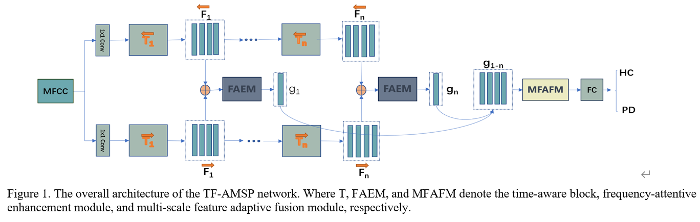

# TF-AMSP

Tensorflow implementation of CIOTSC 2023 paper, "Early Diagnosis of Parkinson's Disease via Speech Signal Recognition: A Time-Frequency Adaptive Multi-Scale Sensing Network" 

### Introduction

This study introduces a time-frequency adaptive multi-scale sensing network (TF-AMSP) designed for speech analysis, which can not only capture the intricate time-frequency features embedded within speech signals, but also adeptly process critical information across varying time scales.


## Usage:

> **Place Your MFCC features files (*.npy) in the MFCC folder**
>
>**Your MFCC properties file should be in the form of a dictionary, with x corresponding to mfcc features and y corresponding to data labels**

### Requirements

Our code is based on Python 3 (>= 3.8). There are a few dependencies to run the code. The major libraries are listed as follows:

* Tensorflow-gpu (>= 2.5.0)
* Keras (>= 2.5.0, the same as TF)
* Scikit-learn (== 1.0.2)
* NumPy (>= 1.19.5)
* SciPy (== 1.8.0)
* librosa (== 0.8.1)
* Pandas (== 1.4.1)
* ......

```bash
$ pip install -r requirement.txt
```

### Preprocessing

In the experiments, the 40-D static MFCCs are extracted using the Librosa toolbox with the **default settings**. Specifically, the frame length is 50 ms, the frame shift is 12.5 ms, the sample rate is 22050 Hz and the window function added for the speech is Hamming window.

```python
def get_feature(file_path: str, mfcc_len: int = 39, mean_signal_length: int = 100000):
  	"""
    file_path: Speech signal folder
    mfcc_len: MFCC coefficient length
    mean_signal_length: MFCC feature average length
  	"""
    signal, fs = librosa.load(file_path)
    s_len = len(signal)

    if s_len < mean_signal_length:
        pad_len = mean_signal_length - s_len
        pad_rem = pad_len % 2
        pad_len //= 2
        signal = np.pad(signal, (pad_len, pad_len + pad_rem), 'constant', constant_values = 0)
    else:
        pad_len = s_len - mean_signal_length
        pad_len //= 2
        signal = signal[pad_len:pad_len + mean_signal_length]
    mfcc = librosa.feature.mfcc(y=signal, sr=fs, n_mfcc=39)
    mfcc = mfcc.T
    feature = mfcc
    return feature
```

### Training and Testing

#### Training

```bash
$ python main.py --mode train
```

#### Testing

If you want to test your model on 10-fold cross-validation manner with `X' random seed, you can run following commands:

```bash
$ python main.py --mode test
```

## Folder structure

```
TF-AMSP
├─ Code
│    ├─ MFCC (Place Your MFCC features files here)
│    ├─ Models (Store model files)
│    ├─ Results (Store result files)
│    ├─ Test_Models (Place Your Model files here)
│    ├─ Model.py
│    ├─ TIMNET.py
│    ├─ Common_Model.py
│    ├─ main.py
│    └─ requirement.txt
├─ README.md
```

